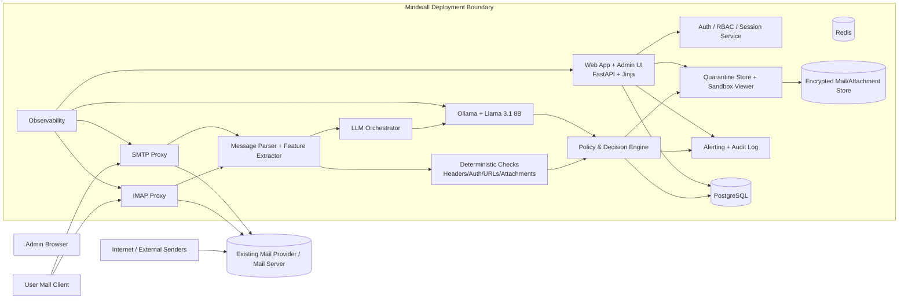
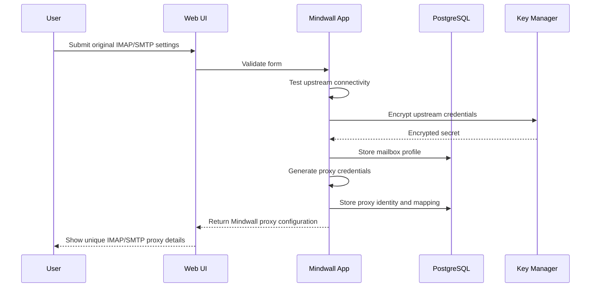
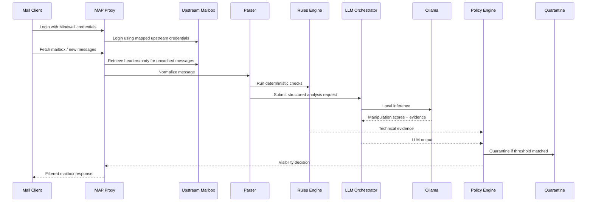
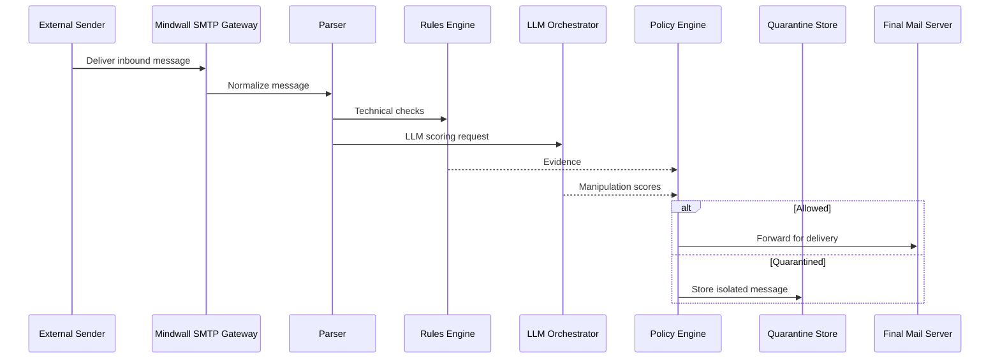
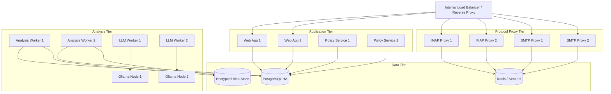

# Mindwall Architecture

## 1. Executive Summary

**Mindwall** is a fully self-hosted, privacy-first email security platform designed to detect phishing, coercion, and psychologically manipulative communications **without sending any message data outside the customer’s environment**.

Mindwall sits between the user and their existing mail infrastructure through **local IMAP and SMTP proxy services**. Incoming communications are intercepted, normalized, inspected, scored across **12 psychological manipulation dimensions**, and then either:

- delivered normally,
- tagged with risk metadata,
- held for review,
- or quarantined into a secure sandbox.

Inference runs **100% on-premises** through **Ollama** using a locally hosted **Llama 3.1 8B** model. The platform is built in **Python**, with a server-rendered web UI using **Jinja templates**, **HTML**, **Tailwind CSS CDN**, and **JavaScript**.

This document defines an **enterprise-grade target architecture** that supports:

- self-hosted single-node deployments,
- secure multi-user operation,
- administrative visibility and auditability,
- policy-driven quarantine workflows,
- and future horizontal scale for larger organizations.

---

## 2. Product Goals

### Functional goals

1. Intercept incoming email communications through a local proxy layer.
2. Analyze messages for phishing and social engineering risk.
3. Score content across **12 psychological manipulation dimensions**.
4. Quarantine suspicious mail in an isolated sandbox.
5. Alert administrators with explainable evidence and risk reasoning.
6. Allow each registered user to keep using their existing mailbox provider through a Mindwall-issued proxy configuration.
7. Preserve privacy through **fully local inference and storage**.

### Non-functional goals

1. **Zero external data egress** for message content or model prompts.
2. **Enterprise auditability** for every decision and override.
3. **Defense in depth** across protocol, content, attachment, and behavioral signals.
4. **Operational resilience** with configurable fail-open/fail-closed behavior.
5. **Low-latency message access** for normal mail workflows.
6. **Clear separation** between control plane and data plane.
7. **Python-first implementation** across backend, services, jobs, and UI rendering.

---

## 3. Architectural Principles

1. **Privacy first**  
   No message bodies, headers, attachments, embeddings, or prompts leave the deployment boundary.

2. **Local-first inference**  
   LLM inference is served only by local Ollama instances.

3. **Proxy-based interception**  
   Existing mail systems remain the system of record; Mindwall adds a security enforcement layer.

4. **Explainable scoring**  
   Every quarantine decision must include traceable reasons, evidence, and confidence.

5. **Composable detection pipeline**  
   LLM scoring is only one layer. Header analysis, authentication results, URL inspection, attachment analysis, and deterministic rules all contribute.

6. **Separation of duties**  
   End users consume mail; administrators manage policy; security analysts review quarantined mail.

7. **Secure-by-default storage**  
   Credentials, proxy secrets, analysis artifacts, and quarantined mail are encrypted at rest.

---

## 4. Critical Deployment Modes

Mindwall should support **two operating modes** because the user’s requirement blends mailbox proxying with quarantine enforcement.

### Mode A — Client-edge proxy mode
The user registers their original IMAP/SMTP settings in Mindwall and then configures their mail client to use the Mindwall proxy.

- **IMAP proxy** intercepts mailbox reads and can hide, flag, or virtually quarantine suspicious messages from the user.
- **SMTP proxy** intercepts outbound sending and admin notifications.
- Existing upstream mailbox remains unchanged.

**Important limitation:** in this mode, incoming mail has already reached the upstream mailbox before Mindwall sees it. Mindwall can still block visibility and create a local quarantine experience, but it is not true pre-delivery isolation.

### Mode B — Inline mail-gateway mode (recommended for enterprise)
Mindwall is placed in front of the organization’s mail delivery path as an inbound SMTP gateway or mail relay.

- Mail is analyzed **before final delivery** to the user mailbox.
- Suspicious messages can be truly diverted into quarantine.
- IMAP proxy is still useful for user access, review, and release workflows.

**Recommendation:** build the architecture so both modes share the same detection engine and policy engine, but keep gateway mode as the target for enterprise customers.

---

## 5. High-Level System Context



---

## 6. Logical Architecture

Mindwall is organized into **two major planes**.

### 6.1 Control Plane
Handles configuration, registration, policy, administration, and reporting.

**Components:**
- Web application
- Admin dashboard
- User onboarding and mailbox registration
- Proxy credential issuance
- Policy management
- Quarantine review workflows
- Audit and reporting
- RBAC and authentication

### 6.2 Data Plane
Handles live email interception, analysis, scoring, and enforcement.

**Components:**
- IMAP proxy
- SMTP proxy
- Message ingestion and normalization
- LLM scoring pipeline
- Rule engine
- Quarantine service
- Notification pipeline

This split allows operational scaling of live traffic independently from the admin UI.

---

## 7. Core Components

## 7.1 Web Application
**Suggested implementation:** FastAPI + Jinja templates

Responsibilities:
- User registration and onboarding
- Original IMAP/SMTP configuration capture
- Proxy credential generation
- Admin dashboards
- Policy configuration
- Quarantine review UI
- Incident timelines and evidence display
- Release / block / allowlist actions

### UI sections
- Login and session management
- User mailbox registration page
- Proxy setup page
- Risk dashboard
- Quarantine inbox
- Message detail view with evidence
- Model health and queue health
- Audit logs
- Settings and policy administration

---

## 7.2 User Registration and Mailbox Mapping Service
When a user registers, Mindwall stores:

- original IMAP host, port, TLS mode
- original SMTP host, port, TLS mode
- original username
- encrypted original password or OAuth-equivalent token material
- mailbox ownership metadata
- tenant/user policy bindings

Mindwall then generates:

- a **Mindwall proxy username**
- a **Mindwall proxy password or token**
- optional per-user proxy hostname or port mapping
- a mailbox profile tied to the upstream account

### Recommended design
Use **shared IMAP and SMTP listeners** with unique Mindwall credentials per user rather than one dedicated process per user. This is simpler, safer, and easier to scale.

Example:
- `imap.mindwall.local:993`
- `smtp.mindwall.local:587`
- unique credentials per mailbox/user

Optional enterprise extension:
- unique subdomains per tenant or business unit
- per-tenant listener isolation

---

## 7.3 IMAP Proxy Service
The IMAP proxy is the core component for user-visible inbound protection in proxy mode.

Responsibilities:
- Authenticate the user against Mindwall credentials
- Resolve the mapped upstream mailbox configuration
- Connect securely to the upstream IMAP server
- Intercept message listing, fetch, and search operations
- Decide whether a message is:
  - visible,
  - flagged,
  - held,
  - or replaced by a quarantine placeholder
- Maintain a mapping between upstream message identifiers and Mindwall analysis state

### Key design requirements
1. **Non-destructive interception**  
   Do not alter upstream messages by default.

2. **UID mapping layer**  
   Maintain a local index that maps upstream UID/Message-ID to Mindwall verdicts and quarantine state.

3. **Mailbox virtualization**  
   Present a filtered view of the mailbox to the user, including a separate virtual quarantine folder if desired.

4. **Latency control**  
   Avoid synchronous full-message rescoring during each fetch. Use cached verdicts and background workers.

5. **Safe fallback**  
   If Mindwall is degraded, policy determines whether mail remains visible, temporarily hidden, or bypassed.

---

## 7.4 SMTP Proxy Service
Responsibilities:
- Accept mail submissions from user clients
- Authenticate against Mindwall-issued credentials
- Forward legitimate outbound mail to the original upstream SMTP server
- Generate internal alerts or quarantine notifications
- Optionally score outbound messages for data exfiltration, impersonation, or compromised-account behavior in later phases

Although Mindwall’s first priority is inbound risk, the SMTP proxy is strategically useful because it:
- standardizes client configuration,
- gives Mindwall a complete mail-control surface,
- and supports secure notification routing.

---

## 7.5 Message Ingestion and Normalization Service
Responsibilities:
- Parse raw RFC 5322 messages
- Decode multipart bodies
- Extract plain text, HTML text, and attachment metadata
- Normalize links, sender identity, reply-to mismatch, subject patterns, and routing headers
- Generate canonical message records for downstream analysis

### Parsed artifacts
- envelope metadata
- transport metadata
- headers
- text/plain body
- rendered text from HTML body
- URLs and domains
- attachment list
- hashes and MIME types
- SPF/DKIM/DMARC results if available

---

## 7.6 Deterministic Security Checks Engine
LLM analysis should not operate alone. Mindwall should combine content reasoning with deterministic security evidence.

### Deterministic checks include
- SPF, DKIM, DMARC validation
- sender domain reputation input hooks
- display-name / reply-to mismatch
- lookalike domain heuristics
- suspicious URL structure
- link text vs destination mismatch
- attachment type risk
- embedded form detection
- password/OTP/credential request patterns
- payment redirection or invoice manipulation signals
- unusual header routing or forged auth results

This engine produces a **feature vector** that is passed to the scoring engine and optionally injected into the LLM prompt.

---

## 7.7 LLM Orchestrator
Responsibilities:
- Build structured prompts from normalized message data
- Include deterministic evidence and policy context
- Invoke Ollama locally
- Parse structured JSON output from the model
- Retry or degrade gracefully if model output is malformed

### Design constraints
- Never send full mail content outside the local environment
- Keep prompts deterministic and compact
- Prefer structured outputs over free-form text
- Version all prompts for auditability

### Example LLM output contract
```json
{
  "overall_risk": 0.91,
  "manipulation_dimensions": {
    "authority_pressure": 0.84,
    "urgency_pressure": 0.97,
    "scarcity": 0.41,
    "fear_threat": 0.72,
    "reward_lure": 0.33,
    "curiosity_bait": 0.21,
    "reciprocity_obligation": 0.18,
    "social_proof": 0.11,
    "secrecy_isolation": 0.63,
    "impersonation": 0.89,
    "compliance_escalation": 0.74,
    "credential_or_payment_capture": 0.92
  },
  "summary": "Message uses urgency, impersonation, and credential capture cues.",
  "evidence": [
    "Sender display name does not match reply-to domain",
    "Requests immediate password reset through external link",
    "Uses pressure language and deadline cues"
  ],
  "recommended_action": "quarantine",
  "confidence": 0.87
}
```

---

## 7.8 Psychological Manipulation Taxonomy
Mindwall’s scoring model should be built around a configurable taxonomy of **12 manipulation dimensions**.

### Recommended default dimensions
1. **Authority pressure**
2. **Urgency pressure**
3. **Scarcity**
4. **Fear / threat**
5. **Reward / lure**
6. **Curiosity bait**
7. **Reciprocity / obligation**
8. **Social proof**
9. **Secrecy / isolation pressure**
10. **Impersonation / identity abuse**
11. **Compliance escalation**
12. **Credential or payment capture intent**

These should be treated as **configurable labels**, not hard-coded assumptions, so the organization can adapt terminology and thresholds.

---

## 7.9 Risk Scoring and Policy Engine
The policy engine consumes:
- deterministic features,
- LLM output,
- message history,
- sender context,
- user policy,
- and system health state.

It produces a final verdict such as:
- `allow`
- `allow_with_banner`
- `soft_hold`
- `quarantine`
- `reject` (gateway mode only)
- `escalate_to_admin`

### Policy inputs
- overall risk score
- per-dimension thresholds
- authentication failures
- attachment type policies
- sender allow/block lists
- business-unit sensitivity rules
- system failover mode

### Recommended policy behavior
- Use **deterministic hard blocks** for clearly malicious technical evidence.
- Use **LLM-assisted quarantine** for manipulative or ambiguous content.
- Require **explainability payloads** for every quarantine decision.

---

## 7.10 Quarantine and Sandbox Service
Responsibilities:
- Store suspicious messages and attachments in an isolated repository
- Prevent direct execution of active content
- Render safe previews in the admin UI
- Support release, delete, annotate, and export operations
- Track all review actions in immutable audit logs

### Sandbox principles
- Attachment previews must be rendered through safe conversion layers
- No active external resource loading
- No remote image fetches
- HTML must be sanitized before rendering
- Macros, scripts, and forms must never execute in the review UI

### Quarantine storage model
- encrypted raw message blob
- extracted safe text preview
- extracted attachment hashes and metadata
- verdict history
- analyst comments
- release status

---

## 7.11 Alerting and Incident Workflow
Responsibilities:
- Notify admins when high-risk messages are quarantined
- Provide evidence-backed summaries
- Track triage state and resolution
- Support escalation rules by user, team, or tenant

### Alert channels
- in-app admin alerts
- local email notifications via Mindwall SMTP proxy
- webhook-style internal notifications for on-prem SIEM integrations

No telemetry should leave the environment unless explicitly configured by the customer.

---

## 7.12 Storage Layer
### PostgreSQL
Primary relational store for:
- users
- mailbox profiles
- tenant config
- policy definitions
- verdict metadata
- message indexes
- audit logs
- quarantine indexes
- model/prompt versions

### Redis
Used for:
- short-lived caches
- task queues
- rate limiting
- session support
- IMAP verdict lookup cache

### Encrypted blob storage
Used for:
- raw quarantined `.eml` files
- attachments
- rendered safe previews
- evidence artifacts

For single-node deployments, local encrypted filesystem storage is acceptable. For enterprise deployments, use encrypted object-compatible storage inside the deployment boundary.

---

## 7.13 Secrets and Key Management
Secrets include:
- upstream IMAP/SMTP credentials
- Mindwall proxy credentials
- session signing keys
- database credentials
- encryption keys

### Requirements
- Encrypt upstream mailbox credentials at rest
- Use a dedicated key-encryption-key and data-encryption-key model
- Separate app secrets from data encryption keys
- Support future HSM or Vault integration, while keeping local-file key management available for simpler deployments

---

## 7.14 Observability Stack
Mindwall should expose enterprise-grade operational visibility.

### Required telemetry
- service health
- proxy connection counts
- IMAP latency
- SMTP latency
- queue depth
- Ollama inference latency
- model error rate
- quarantine rate
- false positive release rate
- policy engine decision counts

### Logs
- structured JSON logs
- per-message correlation IDs
- no accidental secret leakage
- configurable retention

### Metrics
- Prometheus-style metrics endpoint
- local dashboards
- optional OpenTelemetry export to on-prem collectors only

---

## 8. End-to-End Flows

## 8.1 User Registration Flow


---

## 8.2 Incoming Mail Analysis in Proxy Mode


---

## 8.3 Incoming Mail Analysis in Gateway Mode


---

## 9. Recommended Service Boundaries

For maintainability, split Mindwall into the following Python services.

1. **web-app**  
   FastAPI + Jinja UI, auth, admin workflows.

2. **imap-proxy**  
   Async protocol server for user mailbox access.

3. **smtp-proxy**  
   Async SMTP submission and optional gateway handling.

4. **analysis-worker**  
   Parser, feature extraction, deterministic checks.

5. **llm-worker**  
   Prompt assembly, Ollama calls, output validation.

6. **policy-service**  
   Decision logic and threshold evaluation.

7. **quarantine-service**  
   Secure storage, preview generation, release workflows.

8. **scheduler/background-jobs**  
   Re-analysis, cleanup, health checks, cache warming.

This decomposition supports scaling without forcing a microservices-only deployment. In smaller installations, services can be packaged together as a modular monolith.

---

## 10. Deployment Topology

## 10.1 Single-node deployment
Suitable for pilots and SMB environments.

### Components on one host
- reverse proxy / TLS terminator
- FastAPI web app
- IMAP proxy
- SMTP proxy
- analysis workers
- policy engine
- quarantine service
- Ollama
- PostgreSQL
- Redis
- encrypted local blob storage

### Benefits
- simple deployment
- minimal operational overhead
- easy air-gapped setup

### Constraints
- limited throughput
- single point of failure
- lower isolation between heavy inference and proxy traffic

---

## 10.2 Enterprise HA deployment
Recommended for larger organizations.



### HA design notes
- IMAP/SMTP proxies should be stateless where possible.
- Session and verdict caches belong in Redis.
- PostgreSQL must use regular backups and preferably synchronous local replication.
- Ollama nodes should be isolated from UI traffic.
- Blob storage should be encrypted and replicated inside the environment.

---

## 11. Security Architecture

## 11.1 Identity and access
- Separate roles: `user`, `admin`, `security_analyst`, `system_operator`
- Session-based web auth with secure cookies
- MFA support for admin roles
- Per-tenant or per-business-unit access controls for enterprise use

## 11.2 Network security
- Internal-only service mesh or segmented network
- TLS for web, IMAP, and SMTP endpoints
- Restrict Ollama to internal network only
- No public exposure of database, Redis, or blob storage

## 11.3 Data security
- Encrypt upstream credentials at rest
- Encrypt quarantined messages and attachments at rest
- Sanitize HTML before previewing
- Store raw mail separately from rendered review artifacts

## 11.4 Auditability
Every sensitive action must be logged, including:
- registration changes
- policy changes
- message verdicts
- quarantine releases
- analyst overrides
- login events
- secret rotation events

## 11.5 Zero egress stance
By default, the deployment should deny:
- remote model APIs
- third-party telemetry
- external script or image loads in UI
- cloud logging sinks

---

## 12. Reliability and Failure Handling

### Fail-open vs fail-closed
Mindwall should support a **per-deployment policy**.

- **Fail-open:** if analysis is unavailable, mail remains accessible to reduce business disruption.
- **Fail-closed:** if analysis is unavailable, new mail is held or hidden until analysis recovers.

### Recommended default
- Proxy mode: fail-open with strong admin alerts
- Gateway mode: configurable by tenant sensitivity

### Key failure cases
1. **Ollama unavailable**  
   Use deterministic rules only and mark verdicts as degraded.

2. **Redis unavailable**  
   Fall back to direct DB reads with reduced performance.

3. **PostgreSQL unavailable**  
   Enter protective mode; proxies may allow temporary passthrough depending on policy.

4. **Upstream IMAP unavailable**  
   Surface upstream outage transparently to the user.

5. **Malformed model output**  
   Retry with strict schema prompt; otherwise downgrade to rules-only verdict.

---

## 13. Scalability Strategy

### Horizontal scaling points
- IMAP proxy replicas
- SMTP proxy replicas
- analysis workers
- LLM workers
- Ollama nodes

### Performance principles
- Cache verdicts by message hash / Message-ID / mailbox UID mapping
- Avoid repeated LLM rescoring of unchanged messages
- Precompute previews asynchronously
- Separate protocol handling from heavy analysis work
- Use queue-based backpressure to protect proxies

### Throughput model
For enterprise installations, proxies must remain responsive even when inference is slow. Therefore:
- protocol services should enqueue analysis work,
- return cached or provisional states,
- and update verdicts asynchronously.

---

## 14. Data Model Overview

### Core relational entities
- `tenants`
- `users`
- `roles`
- `mailbox_profiles`
- `proxy_credentials`
- `messages`
- `message_headers`
- `message_artifacts`
- `message_scores`
- `dimension_scores`
- `policy_rules`
- `verdicts`
- `quarantine_items`
- `alerts`
- `audit_events`
- `prompt_versions`
- `model_versions`

### Important indexes
- message hash
- Message-ID
- mailbox profile + upstream UID
- quarantine status
- verdict state
- created_at / analyzed_at timestamps

---

## 15. API and Internal Contract Design

Although the UI is server-rendered, the backend should still expose internal service contracts.

### Suggested internal APIs
- `POST /internal/analyze-message`
- `POST /internal/apply-policy`
- `POST /internal/quarantine/{id}/release`
- `POST /internal/quarantine/{id}/delete`
- `POST /internal/mailbox/test-connection`
- `POST /internal/mailbox/register`
- `GET /internal/message/{id}/verdict`
- `GET /internal/health/model`

### Protocol between services
Use JSON over HTTP for control-plane and worker interactions initially. Move to a message bus only if operational scale demands it.

---

## 16. Technology Mapping

### Python stack recommendation
- **FastAPI** for web app and internal APIs
- **Jinja2** for server-rendered templates
- **asyncio** for protocol and worker concurrency
- **Redis** for caching and queueing
- **PostgreSQL** for relational persistence
- **Ollama** for local inference
- **Pydantic** for strict schema contracts
- **SQLAlchemy** or SQLModel for ORM/data access
- **Alembic** for migrations
- **structlog** or standard JSON logging

### Frontend stack recommendation
- HTML templates rendered with Jinja
- Tailwind CSS via CDN
- minimal JavaScript for live tables, filters, and quarantine actions

This aligns with the requirement to keep the app Python-centric while delivering a clean admin experience.

---

## 17. Compliance and Governance Readiness

Mindwall’s architecture should support future compliance requirements by design.

### Readiness features
- immutable audit trail
- configurable retention
- evidence-backed decisions
- local-only data processing
- role-based review workflows
- exportable incident reports
- model and prompt version traceability

This is especially valuable for regulated environments where mail content cannot be sent to public AI providers.

---

## 18. Recommended Build Phases

### Phase 1 — Secure MVP
- user registration
- encrypted upstream config storage
- shared IMAP/SMTP proxy listeners
- parser + deterministic rule engine
- Ollama integration
- 12-dimension scoring output
- admin dashboard
- quarantine inbox
- release and delete workflows

### Phase 2 — Enterprise hardening
- HA deployment support
- RBAC refinement
- audit export
- policy editor
- safe HTML and attachment preview pipeline
- improved observability
- model health management

### Phase 3 — Advanced security controls
- gateway mode SMTP ingress
- tenant isolation enhancements
- SIEM integration
- user/banner education workflows
- historical sender behavior analysis
- adaptive policy tuning

---

## 19. Key Design Decisions to Preserve

1. **Detection engine must be shared across proxy mode and gateway mode.**
2. **LLM output must always be structured and schema-validated.**
3. **Quarantine decisions must be explainable and auditable.**
4. **Credential handling must use strong encryption and key separation.**
5. **Proxy services must stay lightweight and async.**
6. **Mindwall must remain useful even when the LLM layer degrades.**
7. **No remote dependence should be required for core functionality.**

---

## 20. Final Recommendation

For an enterprise-grade implementation, Mindwall should be built as a **Python modular monolith with clear service boundaries**, not as an overly fragmented microservice system from day one.

### Recommended starting architecture
- FastAPI web app with Jinja templates
- async IMAP and SMTP proxies
- background analysis workers
- local Ollama inference node
- PostgreSQL + Redis + encrypted blob storage
- quarantine and evidence workflows

### Strategic architecture path
1. Start with **proxy mode** for quick adoption.
2. Design all analysis and policy layers so they also work in **true gateway mode**.
3. Harden storage, auditing, and review workflows before adding advanced UI features.
4. Treat the **12-dimension manipulation model** as a first-class policy object, not just a model output.

This gives Mindwall a strong foundation as an **email firewall for privacy-sensitive organizations** while staying aligned with the constraints of full self-hosting, Python-only development, and local LLM inference.